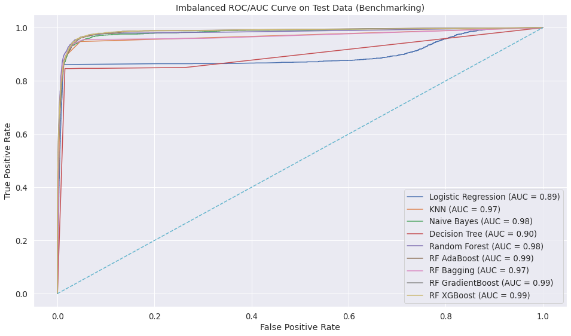
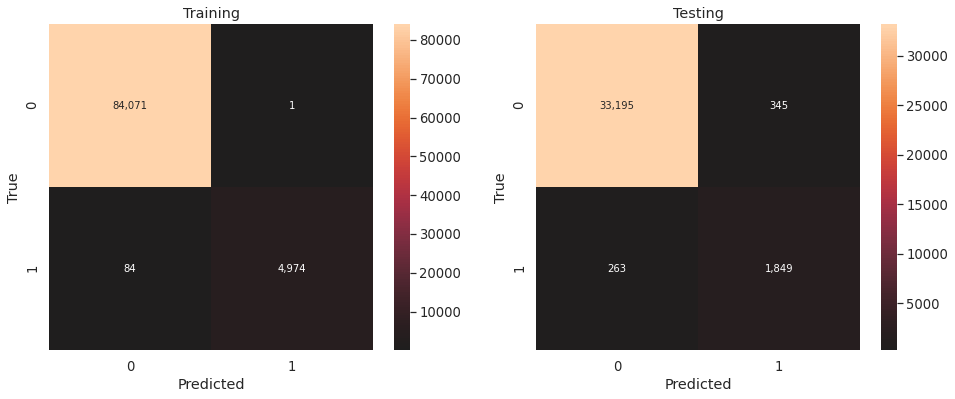

[](https://mybinder.org/v2/gh/Skellet0r/marketing-analysis/master)

# Marketing Analysis

RNS Ltd., is a UK-based online retailer of unique gift-ware. The company mainly
sells their products to other businesses, wholesalers, in large batches.
RNS Ltd., has decided to create a marketing division to promote their products
and drive sales. However, they're **unaware of which customers
they should focus their marketing efforts on**.

Our goal was to segment the market and to also create a predictive model to determine which
customers to market to in the next month, based on prior data.

## Components

- [Charter](docs/project/charter.md): the project charter was the first step when starting this project,
  and is a sort of outline of this project. It clarifies who our stakeholders are, what we aim to do, and
  how we intend to complete this project. If this is your first time looking at this project, the project
  charter is the best place to start.
- [Conclusion/Exit Report](docs/project/exit-report.md): an outline of this project's end results, it provides
  an overview mainly for a technical audience at the conclusion of the project.
- [Data](data/): this is typically where data used in this project is stored. For large datasets which can't
  be stored within the repository due to their massive size, steps will be given to import the data.
- [Data Dictionaries](docs/data_dictionaries): any custom or client delivered data dictionaries can be found here.
- [Notebooks](notebooks/): this is where all the jupyter notebooks for this project are stored.
  Instead of having one behemoth of a jupyter notebook, there are multiple distinct notebooks each
  focusing on a different phase of the project. A majority of the notebooks focus on modeling and using different
  classifiers. Each notebook is numbered in the order they were completed, this keeps everything in a linear order.
- [Source Code](src/): this is where custom python functions/variables are stored that are used throughout the project.
  It is installed into the conda environment when you first create the environment, and any changes automagically appear.
- [Tests](tests/): this is where a few unit tests are stored
- [Project Environment](environment.yml): to enable reproducibility of the project environment I recommend you use the
  environment.yml file along with anaconda. However there is also an alternative requirements.txt file in the event
  that one is unable to access/install anaconda. Reproducing the same environment allows for consistent results.
- [Presentation](https://Skellet0r.github.io/marketing-analysis)

## Quick Start

If you want your own local instance of this project follow the steps below.

1. Clone this repository

```shell
$ git clone https://github.com/Skellet0r/marketing-analysis.git
```

2. Initialize the environment

```shell
$ cd ./marketing-analysis
$ conda env create -f environment.yml
```

3. Activate the environment

```shell
$ conda activate marketing-analysis
```

3. Run the initialization script to pull down data and decompress data

```shell
$ project init
```

5. Enjoy 😃

> If you'd like to interactively inspect this project, and don't have access to a terminal, anaconda, or pip.
  Click the `launch binder` tag.

## Findings

> For visualizations pertaining to clustering, view the presentation (plotly visuals can't be embedded into markdown)

Our clustering resulted in 6 clusters, we then grouped these
into 2 classes, based on the RFM values of the group in general.


We chose k based on the distortion and fit time, selecting k=6.


Concerning our predictive modeling the following are some of the visualizations from modeling.

### Benchmarking



| rank | classifier          | cv_f1    | test_f1  |
| ---- | ------------------- | -------- | -------- |
| 1    | Random Forest       | 0.812773 | 0.860195 |
| 2    | RF Bagging          | 0.800045 | 0.845482 |
| 3    | RF XGBoost          | 0.828603 | 0.838829 |
| 4    | RF AdaBoost         | 0.829618 | 0.838354 |
| 5    | Logistic Regression | 0.825998 | 0.837477 |
| 6    | Naive Bayes         | 0.828174 | 0.837284 |
| 7    | RF GradientBoost    | 0.829216 | 0.837284 |
| 8    | KNN                 | 0.806837 | 0.831312 |
| 9    | Decision Tree       | 0.733179 | 0.810063 |

Since we are working with time series data, one of the most important things was 
preventing data leakage.

### Random Forest

For scoring, we particularly are interested in recall, as we want
to maximize the number of True positives we identify. There is no
additional cost for predicting a False positive.

| set      | precision | recall   | accuracy | f1       |
| -------- | --------- | -------- | -------- | -------- |
| Training | 0.999799  | 0.983393 | 0.999046 | 0.991528 |
| Testing  | 0.842753  | 0.875473 | 0.982946 | 0.858802 |

Confusion Matrix (Train & Test Sets)



Here we have the confusion matrices for our Random Forest classifier, after doing some randomized searching, we could not
identify a model with better performance.

ROC/AUC Curve for Random Forest Model w/ Holdout:


Our model does appear to have some bias as we can see with the f1 scoring, however, the variation amongst out of sample data
appears to be very balanced.

Scoring holdout data:

| set      | precision | recall   | accuracy | f1       |
| -------- | --------- | -------- | -------- | -------- |
| Training | 0.999799  | 0.983393 | 0.999046 | 0.991528 |
| Testing  | 0.842753  | 0.875473 | 0.982946 | 0.858802 |
| Holdout  | 0.861371  | 0.808086 | 0.977752 | 0.833878 |


## Recommendations

Our recommendation is for our client to focus on marketing to
the higher priority customers, these are customers which
frequently make purchases with our client, and have a history
of being profitable. We would also recommend that our
client on a monthly basis randomly sample from the grouping
of low priority customers, to prevent customers from being left out. There amount of marketing should be inversely proportional to
customer priority (high valued customers get less marketing, low
value customers get high marketing) this way we don't spam our
best customers.

## Next Steps

- Since the data we used is transactional, it would be very beneficial if we added in more features from external sources.
- Since this is a monthly report that needs to be done, we should setup an automated pipeline for our client that is triggered
  at the end of the month.
