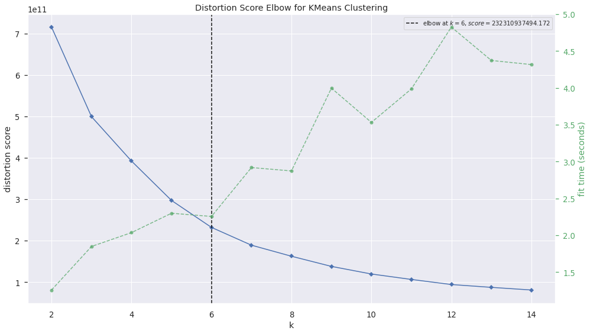
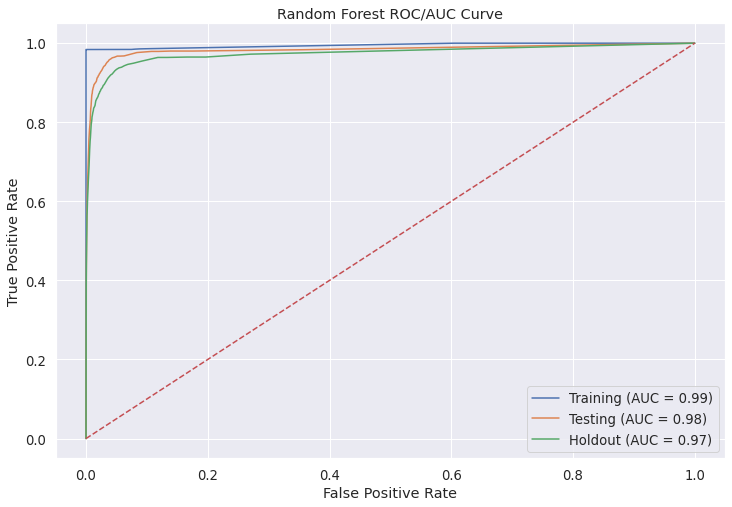

## Strategic Marketing with Clustering and Forecasting

Modeling RNS Ltd. Customer Base <!-- .element: style="font-size: x-large;" -->

---

## Problem Statement

RNS Ltd.'s, new marketing division needs to promote their products and drive sales. 
However, they're unaware of which customers they should focus their marketing efforts on.
They need to identify which customers they should prioritize their marketing efforts on
in order to promote sales.

Note:

1. RNS's new marketing division is unaware of the customer segments they have
2. RNS's new marketing division doesn't know how to segment their customer base to
   promote sales.

---

## Business Value

RNS is currently only tapping into it's local domestic market maximally. With the correct
insight into which customers to market to RNS can tap into countries across North and South America, and along Asia. With USA and China having the two largest GDP's this would be a source of immense wealth.

-- <!-- .element: data-background-iframe="visuals/02-EDA-regional-sales-choropleth.html" data-preload-->

-- <!-- .element: data-background-iframe="visuals/02-EDA-unique-customers-by-region.html" data-preload-->

---

## Methodology

1. RFM modeling
2. Component Analysis
3. Clustering
4. Predictive Forecasting

Note:

1. Component analysis allowed us to maintain the same amount of information at a lower data footprint (5d to 2d)
2. Clustering allows us to group our data in ways we can't visually
3. Predictive forecasting of cluster membership based on historic data.

---

## Clustering & Components

-- <!-- .element: data-background-iframe="visuals/03-pca-clusters.html" data-preload-->

--

### Distortion w/ Fit Time by Cluster Size

  

---

## Predictive Forecasting

For modeling we boiled down our 6 clusters into two groups,
a high priority group and a low priority group.

This was determined by each clusters RFM value compared to others.

--

### Benchmarks

  

-- 

### Benchmarking F1 Scores

<table>
<thead>
<tr>
<th>rank</th>
<th>classifier</th>
<th>cv_f1</th>
<th>test_f1</th>
</tr>
</thead>
<tbody>
<tr>
<td>1</td>
<td>Random Forest</td>
<td>0.812773</td>
<td>0.860195</td>
</tr>
<tr>
<td>2</td>
<td>RF Bagging</td>
<td>0.800045</td>
<td>0.845482</td>
</tr>
<tr>
<td>3</td>
<td>RF XGBoost</td>
<td>0.828603</td>
<td>0.838829</td>
</tr>
<tr>
<td>4</td>
<td>RF AdaBoost</td>
<td>0.829618</td>
<td>0.838354</td>
</tr>
<tr>
<td>5</td>
<td>Logistic Regression</td>
<td>0.825998</td>
<td>0.837477</td>
</tr>
<tr>
<td>6</td>
<td>Naive Bayes</td>
<td>0.828174</td>
<td>0.837284</td>
</tr>
<tr>
<td>7</td>
<td>RF GradientBoost</td>
<td>0.829216</td>
<td>0.837284</td>
</tr>
<tr>
<td>8</td>
<td>KNN</td>
<td>0.806837</td>
<td>0.831312</td>
</tr>
<tr>
<td>9</td>
<td>Decision Tree</td>
<td>0.733179</td>
<td>0.810063</td>
</tr>
</tbody>
</table>

--

### Random Forest Classifier ROC/AUC

  

-- 

### RF Classifier Holdout scores

<table>
<thead>
<tr>
<th>set</th>
<th>precision</th>
<th>recall</th>
<th>accuracy</th>
<th>f1</th>
</tr>
</thead>
<tbody>
<tr>
<td>Training</td>
<td>0.999799</td>
<td>0.983393</td>
<td>0.999046</td>
<td>0.991528</td>
</tr>
<tr>
<td>Testing</td>
<td>0.842753</td>
<td>0.875473</td>
<td>0.982946</td>
<td>0.858802</td>
</tr>
<tr>
<td>Holdout</td>
<td>0.861371</td>
<td>0.808086</td>
<td>0.977752</td>
<td>0.833878</td>
</tr>
</tbody>
</table>

---

### Selected Model

The classifier which we used to generate predictions is a Random Forest classifier, in our trials we got the following results.

<table>
<thead>
<tr>
<th>set</th>
<th>precision</th>
<th>recall</th>
<th>accuracy</th>
<th>f1</th>
</tr>
</thead>
<tbody>
<tr>
<td>Training</td>
<td>0.999799</td>
<td>0.983393</td>
<td>0.999046</td>
<td>0.991528</td>
</tr>
<tr>
<td>Testing</td>
<td>0.842753</td>
<td>0.875473</td>
<td>0.982946</td>
<td>0.858802</td>
</tr>
<tr>
<td>Holdout</td>
<td>0.861371</td>
<td>0.808086</td>
<td>0.977752</td>
<td>0.833878</td>
</tr>
</tbody>
</table>

---

## Recommendations

- Focus on high priority customers
- Inversely market (More to Low priority & Less to High priorty (prevent spamming))
- Randomly sample from low priority when marketing

---

## Future Work

1. Create automated workflow for marketing division which starts on the beginning of each month (reporting workflow)
2. Develop models with reduced bias & variance
3. Use Deep Learning to better pull out hidden information from data.

---

# Thank You